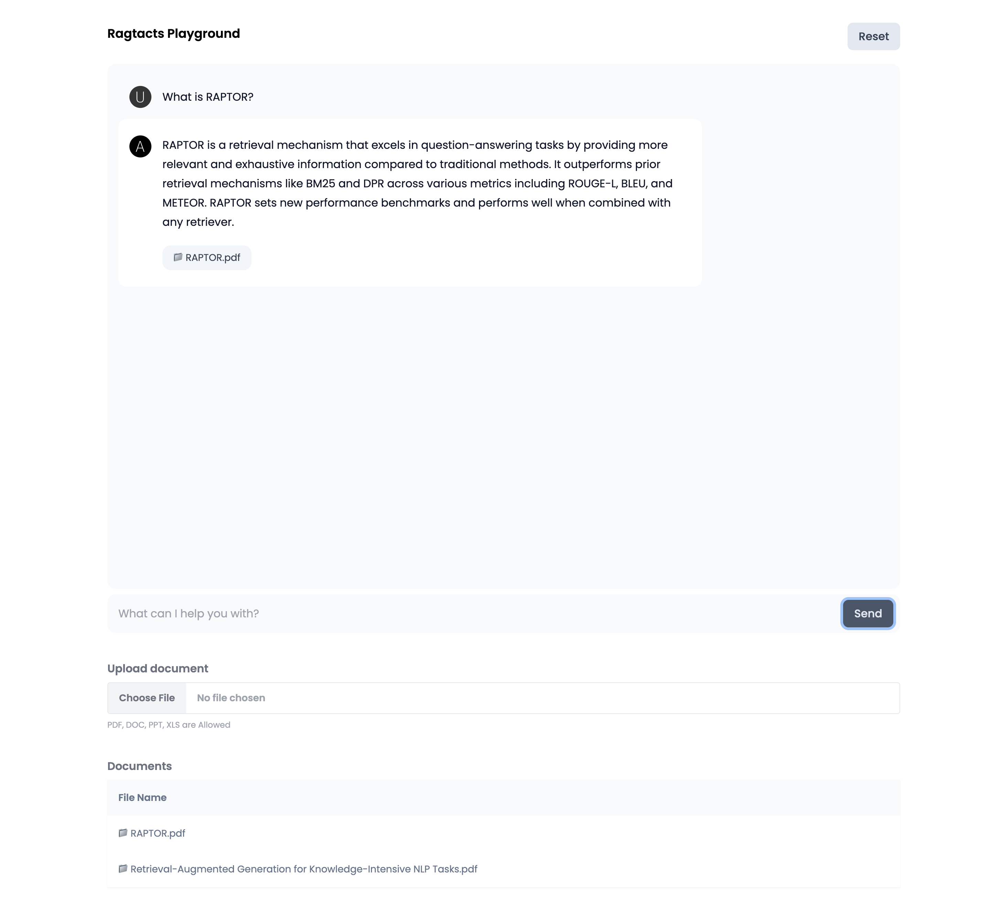
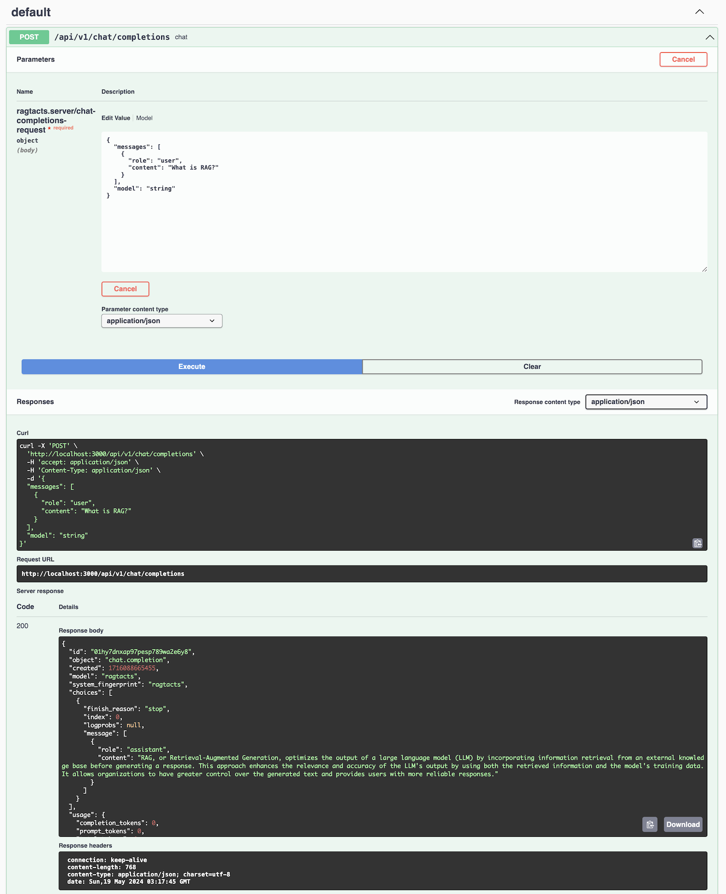

# Ragtacts

Ragtacts로 쉽게 LLM에게 물어보세요!

## 문서

- [English](./README.md)
- [한국어](./README_kr.md)

- [ractacts cljdoc](https://cljdoc.org/d/com.constacts/ragtacts/0.3.2/doc/readme)

## 준비물

### Cljoure 설치하기

클로저를 설치하려면 먼저 [java](https://clojure.org/guides/install_clojure#java)와 
[brew](https://clojure.org/guides/install_clojure#java)를 설치하세요.

```bash
$ brew install clojure/tools/clojure
```

### Clojure REPL 시작하기

`deps.edn` 파일을 만들고 다음 내용을 넣습니다.

[](https://clojars.org/com.constacts/ragtacts)

```clojure
{:deps
 {com.constacts/ragtacts {:mvn/version "0.3.2"}}}
```

그리고 다음 명령어로 Clojure REPL을 실행합니다. ragtacts는 기본 LLM 모델로 OpenAI를 사용하기 때문에 OpenAI API 키가
필요합니다. [OpenAI 문서](https://platform.openai.com/docs/quickstart/step-2-set-up-your-api-key)를 참고해서
키를 준비합니다.

```bash
$ OPENAI_API_KEY=sk-xxxx clj
Clojure 1.11.3
user=> 
```

## Ragtacts 라이브러리 사용법

Ragtacts 라이브러리를 쓰려면 `ractacts.core` 네임스페이스를 `require` 해주면 됩니다.

```clojure
(require '[ragtacts.core :refer :all])
```

### LLM에게 물어보기

질문하고 싶은 내용을 `ask` 함수 인자에 넣어 물어보세요.

```clojure
(ask "Hello!")
;; [{:user "Hello!"} {:ai "Hi there! How can I assist you today?"}]
```

`ask`의 결과는 질문과 답변 형식으로 나옵니다. 결과 목록 항목은 역할과 내용으로 되어 있는 맵입니다. 역할은 `:user`, `:ai`가 
있습니다. 마지막 항목에 LLM이 답한 항목이 `:ai`키 값으로 들어 있습니다.

기본 모델은 OpenAI gpt-4o지만 다른 모델에게 물어볼 수도 있습니다.

```clojure
(-> "Hello!"
    (ask {:model "gpt-4-turbo"})
    last
    :ai)
;; "Hi there! How can I assist you today?"
```

`prompt` 함수로 질문 템플릿을 만들어 쓸 수 있습니다. 템플릿은 Python `str.format` 템플릿 문법을 씁니다.

```clojure
(-> "Tell me a {adjective} joke about {content}."
    (prompt {:adjective "funny" :content "chickens"})
    ask
    last
    :ai)
;; "Sure, here's a classic one for you:\n\nWhy did the chicken go to the séance?\n\nTo ta..."
```

[Langchain Hub](https://smith.langchain.com/hub) 프롬프트를 가져와 쓸 수 있습니다.

```clojure
(require '[ragtacts.prompt.langchain :as langchain])

(-> (langchain/hub "rlm/rag-prompt") 
    (prompt {:context "Ragtacts is an easy and powerful LLM library." 
             :question "What is Ragtacts?"})
    ask
    last
    :ai)
;; "Ragtacts is an easy and powerful LLM library."
```

멀티 모달을 지원하는 [모델](https://platform.openai.com/docs/models)을 사용한다면 이미지에 대해 물어볼 수도 있습니다.

```clojure
(->
   (ask (with-images "What are in these images? Is there any difference between them?"
     "https://upload.wikimedia.org/wikipedia/commons/thumb/d/dd/Gfp-wisconsin-madison-the-nature-boardwalk.jpg/2560px-Gfp-wisconsin-madison-the-nature-boardwalk.jpg"
     (io/input-stream "/tmp/sample.png")))
   last
   :ai)
```

질문 할 때 대화 내용을 조금 입력하면 대화 내용을 바탕으로 답을 줍니다.

```clojure
(-> [{:system "You are a wondrous wizard of math."}
     {:user "2+2"}
     {:ai "4"}
     {:user "2+3"}
     {:ai "5"}
     {:user "What's the square of a triangle?"}]
    ask
    last
    :ai)
;; "The phrase \"square of a triangle\" is a ..."
```

`ask` 함수의 결과는 대화 내용이기 때문에 결과에 대화를 붙여 `ask` 함수를 부르면 이전 대화 맥락에 이어서 물어볼 수 있습니다.

```clojure
(-> (ask "Hi I am Ragtacts")
    (conj "What is my name?")
    ask
    last
    :ai)
;; "You mentioned earlier that your name is Ragtacts. How can I help you today, Ragtacts?"
```

### 자연어로 Clojure 함수를 부르기

`ask` 함수로 Clojure 함수를 자연어로 부를 수 있습니다. LLM이 함수가 어떤 일을 하는지 알려주려면 함수에 다음과 같이
메타데이터를 넣어줘야 합니다.

```clojure
(defn ^{:desc "Get the current weather in a given location"} get-current-weather
    [^{:type "string" :desc "The city, e.g. San Francisco"} location]
    (case (str/lower-case location)
      "tokyo" {:location "Tokyo" :temperature "10" :unit "fahrenheit"}
      "san francisco" {:location "San Francisco" :temperature "72" :unit "fahrenheit"}
      "paris" {:location "Paris" :temperature "22" :unit "fahrenheit"}
      {:location location :temperature "unknown"}))

(-> "What 's the weather like in San Francisco, Tokyo, and Paris?"
    (ask {:tools [#'get-current-weather]})
    last
    :ai)
;; "Here is the current weather in the requested cities:\n\n1. **San Francisco**: 72°F\n2. **Tokyo**: 
;;  10°F\n3. **Paris**: 22°F\n\nIt seems like the temperatures vary significantly across these cities!"  
```

어떤 경우에는 함수를 부른 결과를 그대로 써야하는 경우가 있습니다. 그런 경우에는 `:as` 키에 `:values` 옵션을 넣으면 다음과 
같은 형태로 결과를 받을 수 있습니다.

```clojure
(-> "What 's the weather like in San Francisco, Tokyo, and Paris?"
    (ask {:tools [#'get-current-weather] :as :values})
    last
    :ai)

;; [{:get-current-weather {:location "San Francisco", :temperature "72", :unit "fahrenheit"}} 
;;  {:get-current-weather {:location "Tokyo", :temperature "10", :unit "fahrenheit"}} 
;;  {:get-current-weather {:location "Paris", :temperature "22", :unit "fahrenheit"}}]
```

결과 값은 목록으로 되어 있습니다. 한 질문에 한 함수를 여러 번 부를 수 있기 때문입니다. 항목은 함수 이름 키에 값으로 결과 값을 
담고 있습니다. `:tools`에 함수를 여러 개 넣는다면 LLM이 알맞는 함수를 찾아서 불러주기 때문에 함수 키로 어떤 함수가 불렸는지
알 수 있습니다.

### 벡터 데이터베이스로 더 정확한 답을 받기

벡터 데이터베이스는 데이터를 벡터 형식으로 저장합니다. 벡터 형식으로 저장하면 유사한 데이터를 찾을 수 있습니다. 만약 어떤 책에
있는 내용을 LLM에 물어본다고 해봅시다. LLM은 책 내용을 모르기 때문에 정확한 답을 할 수 없습니다. 하지만 LLM에 프롬프트에 책
내용을 넣어주면 LLM이 그 내용을 참고해서 정확한 답을 할 수 있습니다. 하지만 LLM이 처리할 수 있는 프롬프트 크기는 제한이 있습니다.
벡터 데이터베이스를 사용하면 LLM 프롬프트에 넣을 데이터를 줄 일 수 있습니다. 책 내용을 작게 잘라서 벡터 데이터베이스에 저장하고
질문 내용과 가장 유사한 몇 개의 데이터를 찾아서 LLM 프롬프트에 넣어주면 됩니다. 이러한 방식을 RAG(Retrieval-Augmented 
Generation)이라고 합니다.

Ragtacts를 사용하면 쉽게 RAG를 할 수 있습니다. 먼저 벡터 데이터베이스에 데이터를 저장하고 검색해 봅시다.

```clojure
(let [db (vector-store)]
  (add db ["The new data outside of the LLM's original training data set is called external data."
            "What Is RAG?"
            "The next question may be—what if the external data becomes stale?"
            "Retrieval-Augmented Generation (RAG) is the process of optimizing the output of a large language model."
            "The next step is to perform a relevancy search."
            "Recursive summarization as Context Summarization techniques provide a condensed view of documents"])
  (search db "Tell me about RAG"))
;; ("What Is RAG?" "Retrieval-Augmented Generation (RAG) is the process of optimizing the output of a large language 
;;  model." "Recursive summarizat...)
```

`vector-store` 함수는 메모리에 저장하는 벡터 데이터베이스를 만들어 줍니다. `add` 함수로 벡터 데이터베이스에 문서를 저장하고
`search` 함수로 벡터 데이터베이스에서 가장 유사한 문서를 순서대로 가져옵니다. `search` 함수는 가장 유사한 문서 순서대로 5개를
가져오도록 되어 있습니다. `top-k` 옵션 값으로 가져올 개수를 바꿀 수 있습니다.

```clojure
(let [db (vector-store)]
  (add db ["The new data outside of the LLM's original training data set is called external data."
            "What Is RAG?"
            "The next question may be—what if the external data becomes stale?"
            "Retrieval-Augmented Generation (RAG) is the process of optimizing the output of a large language model."
            "The next step is to perform a relevancy search."
            "Recursive summarization as Context Summarization techniques provide a condensed view of documents"])
  (search db "Tell me about RAG" {:top-k 2}))
;; ("What Is RAG?" "Retrieval-Augmented Generation (RAG) is the process of optimizing the output of a large language 
;;  model.")
```

벡터 데이터베이스에는 벡터로 저장할 문서 말고 추가 정보를 넣고 추가 정보로 걸러 검색할 수 있습니다.

```clojure
(let [db (vector-store)]
  (add db [{:text "What Is RAG?"
              :metadata {:topic "RAG"}}
            {:text "The next question may be—what if the external data becomes stale?"
              :metadata {:topic "Tutorial"}}
            {:text "The next step is to perform a relevancy search."
              :metadata {:topic "Tutorial"}}])
  (search db "Tell me about RAG" {:metadata {:topic "Tutorial"}}))
;; ("The next question may be—what if the external data becomes stale?" "The next step is to..")
```

`"What Is RAG?"` 문서가 `"Tell me about RAG"`와 가장 비슷했지만 `metadata`에 `topic`이 `"Tutorial"` 값인
문서에서만 검색하기 때문에 결과에 `"What Is RAG?"` 값이 나오지 않았습니다.

`search` 함수에 `{:raw? true}` 옵션을 넣으면 결과 값에 저장된 벡터 값과 metadata 값을 가져올 수 있습니다.

```clojure
(let [db (vector-store)]
  (add db [{:text "What Is RAG?"
              :metadata {:topic "RAG"}}
            {:text "The next question may be—what if the external data becomes stale?"
              :metadata {:topic "Tutorial"}}
            {:text "The next step is to perform a relevancy search."
              :metadata {:topic "Tutorial"}}])
  (search db "Tell me about RAG" {:metadata {:topic "Tutorial"}
                                  :raw? true}))
;; [{:text "The next step is to perform a relevancy search." 
;;   :vector [-0.002841026 0.015938155 ...]
;;   :metadata {:topic "Tutorial"}} ...]
```

웹 페이지나 문서(pdf, doc, xls, ppt등)에 있는 텍스트를 가져와 벡터 데이터베이스에 넣고 검색할 수 있습니다.

```clojure
(require '[ragtacts.loader.web :as web])

(let [db (vector-store)
      text (web/get-text "https://aws.amazon.com/what-is/retrieval-augmented-generation/")]
  (add db [text])
  (search db "What is RAG?"))

(require '[ragtacts.loader.doc :as doc])

(let [db (vector-store)
      text (doc/get-text "~/papers/RAPTOR.pdf")]
  (add db [text])
  (search db "What is RAPTOR?"))
```

앞에서 말한 것처럼 벡터 데이터베이스에는 텍스트를 나눠서 넣습니다. `add` 함수는 인자로 넘긴 텍스트가 길면 잘라서 벡터 데이터베이스에
넣습니다. 기본 값은 500 글자입니다. 정확히 500 글자로 자르지 않고 텍스트를 자를 때 중간에 끊기지 않도록 합니다. `vector-store`
함수에 `:splitter` 옵션으로 글자 수를 바꿀 수 있습니다. `:size`와 `:overlap` 옵션을 주면 됩니다. `:overlap` 크기로
텍스트가 잘리지 않는 제한을 지정할 수 있습니다.

```clojure
(let [db (vector-store {:splitter {:size 100 :overlap 10}})
      text (doc/get-text "~/papers/RAPTOR.pdf")]
  (add db [text])
  (search db "What is RAPTOR?"))
```

이제 마지막으로 벡터 데이터베이스에 있는 내용을 바탕으로 LLM에게 물어봅시다. 벡터 데이터베이스에 가져온 내용을 문자열로 합쳐
적절한 프롬프트에 담아 LLM에게 물어보면 됩니다. 예제에서 쓰는 프롬프트는 랭체인 허브에 있는 `rlm/rag-prompt`를 쓰겠습니다.

```clojure
(let [db (vector-store)
        text (web/get-text "https://aws.amazon.com/what-is/retrieval-augmented-generation/")
        rag-prompt (langchain/hub "rlm/rag-prompt")
        question "What is RAG?"]
    (add db [text])
    (-> (ask (prompt rag-prompt {:context (str/join "\n" (search db question))
                                 :question question}))
        last
        :ai))
```

Ragtacts에는 웹 페이지나 폴더에 내용이 바뀌면 바뀐 내용을 새로 가져올 수 있는 `watch` 함수가 있습니다. 이 함수로 바뀌는 
데이터를 벡터 데이터베이스와 맞출 수 있습니다.

```clojure
(def web-wather
  (web/watch {:url "https://aws.amazon.com/what-is/retrieval-augmented-generation/"
              :interval 1000}
              (fn [change-log]
                ;; {:type :create :text "..."}
                (println change-log))))

(web/stop-watch web-wather)

;; WIP
(def folder-wather
  (doc/watch {:path "~/papers"}
              (fn [change-log]
                (println change-log))))

(doc/stop-watch folder-wather)
```

## RAG Playground 실행하기

예제 폴더에는 [electric](https://github.com/hyperfiddle/electric)으로 만든 RAG Playground가 있습니다. 
다음 명령어로 Playground를 실행하고 웹 브라우저에서 [http://localhost:8080](http://localhost:8080)로 접속해보세요.

```bash
$ cd examples/playground
$ clj -A:dev -X dev/-main
```




## Ragtacts를 CLI로 사용하기

Ragtacts는 CLI로 쓸 수도 있습니다. [Releases](https://github.com/constacts/ragtacts/releases/)에 있는 
ractacts.jar 파일을 다운로드 받아서 자바로 실행하면 웹 페이지나, 문서를 기반으로 LLM에게 물어볼 수 있습니다.

```bash
$ java -jar target/ragtacts-standalone.jar -p "What is RAG?" -d https://aws.amazon.com/what-is/retrieval-augmented-generation/
AI: RAG, or Retrieval-Augmented Generation, is a process that enhances the output of a large language model (LLM) by incorporating an information retrieval component. This component pulls relevant information from an external knowledge base and provides it to the LLM, enabling it to generate more accurate responses. This approach offers organizations better control over the generated text output and improves the overall quality of the responses. 
```

`chat` 모드를 사용하면 대화형으로 물어 볼 수 있습니다.

```bash
$ java -jar target/ragtacts-standalone.jar -m chat -d https://aws.amazon.com/what-is/retrieval-augmented-generation/
Prompt: What is RAG?
AI: RAG, or Retrieval-Augmented Generation, is a process that optimizes the output of a large language model by first retrieving information from an external, authoritative knowledge base before generating a response. This allows the model to use both its training data and the new information to create more accurate and reliable answers. This approach gives organizations greater control over generated text and helps improve the quality of the responses. 
Prompt:
```

## Ragtacts를 API 서버로 사용하기

Ragtacts는 API 서버로 쓸 수도 있습니다. 다음 명령어를 입력하고 [http://localhost:3000](http://localhost:3000)에 
접속해보세요. API는 OpenAI [Chat](https://platform.openai.com/docs/api-reference/chat) API와 호환됩니다.

```bash
$ java -jar target/ragtacts-standalone.jar -m server -d https://aws.amazon.com/what-is/retrieval-augmented-generation/
```



## 참여하기

Pull Request를 보내기 전에 [CONTRIBUTING.md](CONTRIBUTING.md) 문서를 읽어보세요.

## License

Copyright © 2024 Constacts, Inc.

Distributed under the Eclipse Public License, the same as Clojure.